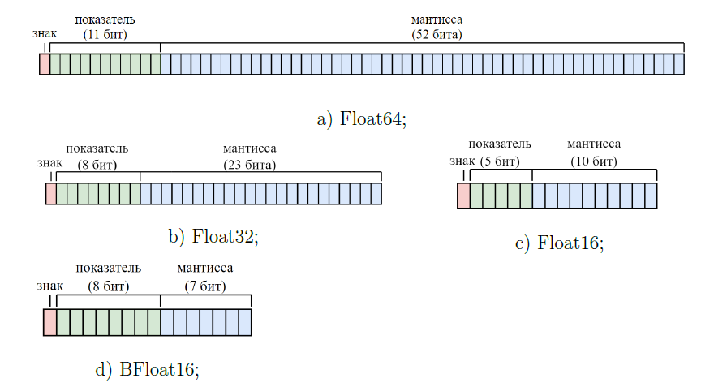
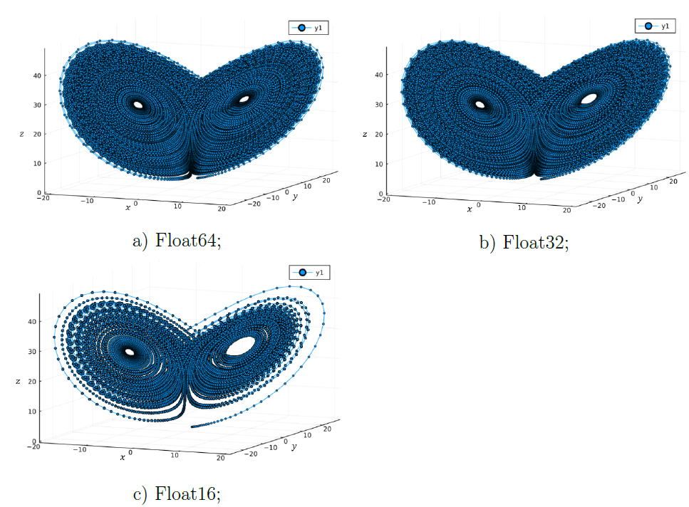
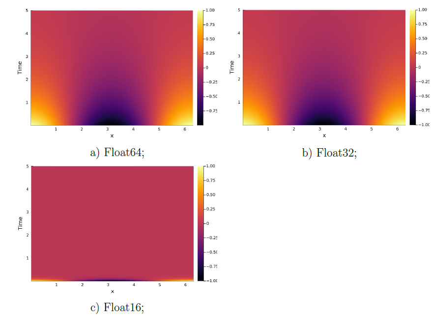
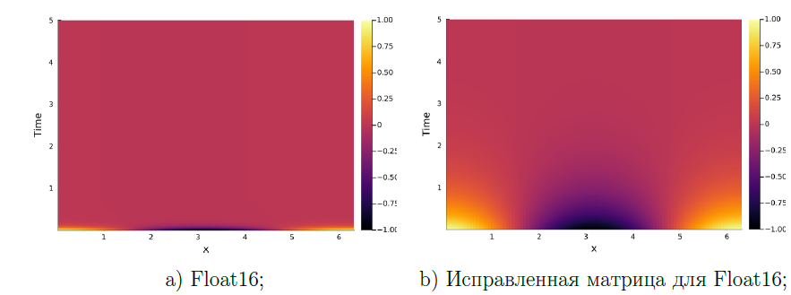
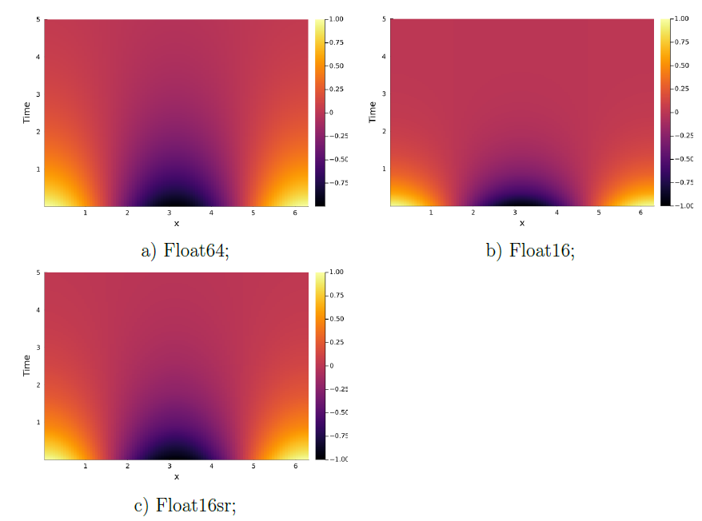
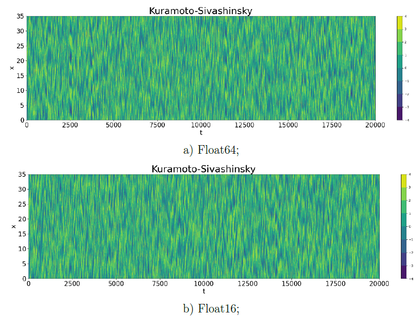
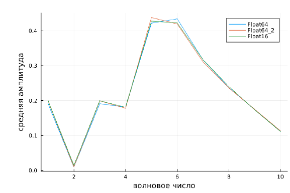
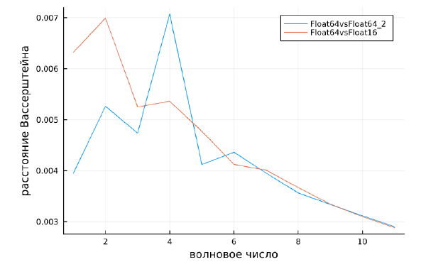

# Дипломный проект "Интегрирование дифференциальных уравнений с использованием чисел с половинной точностью"

Дипломный проект включает в себя исследование половинной точности применительно к численным метеорологическим и климатическим моделям.

## Описание проекта

Числами с плавающей запятой (Floating-point numbers) называется такое представление чисел, описывающее вещественные числа приблизительно, используя целое число с заданной точностью $-$ мантиссу, умноженную на целочисленный показатель степени $-$ порядок, и имеющая фиксированное основание. Например, константа $\displaystyle \pi = 3,141$ может быть представлена как десятичное число с плавающей запятой следующим образом:

```math
3,141 = \underbrace{3141}_\text{мантисса} \times \underbrace {10}_{\text{основание}}\ ^{\overbrace {-3}^{\text{показатель}}}.$$
```

64-битные числа с плавающей запятой двойной точности (Float64) по умолчанию используются для большинства численных моделей. Формат Float64 вносит незначительные ошибки округления, которые в меньшей степени влияют на результат.
Более быстрые вычисления и обмен данными могут быть достигнуты за счет пониженной точности чисел с плавающей запятой, с учетом компромисса между скоростью и точностью. На рисунке ниже представлена визуализация основных типов чисел с плавающей запятой.



Для адаптации решений дифференциальных уравнений (ДУ) к 16-битному формату было рассмотрено 3 модели: модель Лоренца, описывающая конвективные турбулентные движения жидкости, уравнение теплопроводности и уравнение Курамото-Сивашинского.

### Модель Лоренца

Модель Лоренца представляет собой систему из обыкновенных ДУ:
```math
    \begin{cases}
    x'(t) = -\sigma x + \sigma y, \\
    y'(t) = rx - y - xz, \\
    z'(t) = xy - bz.
    \end{cases}
```

Решением этой системы является странный аттрактор или аттрактор Лоренца, представленный на рисунке ниже.



Сравнивая рисунки (a) и (c) можно увидеть, что плотность распределения значений для типа Float16 гораздо ниже, чем для типа Float64. Действительно, если обратиться к компьютерному представлению чисел с плавающей запятой, то можно говорить о большей плотности рациональных чисел в 64-битном представлении.

### Уравнение теплопроводности

Уравнение теплопроводности можно записать в следующем виде:
```math
    \frac{\partial \varphi(x, t)}{\partial t} -  \alpha\frac{\partial^2 \varphi(x, t)}{\partial x^2} = 0,
```
где 
```math
    x \in [0;2\pi], \varphi(x,t)=\varphi(x+2\pi,t), \varphi(x,t)=sin(\pi x), \alpha \in \mathbb{R}.
```

За начальные условия можно принять $\displaystyle \varphi(x, 0)=\varphi_0(x).$ Для простоты принимается  $\displaystyle \varphi_0(x)=cos(x).$ Также определяется линейный дифференциальный оператор $\mathscr{D}^2 = \displaystyle-\alpha\frac{\partial^2}{\partial x^2}$. Тогда выражение (3) принимает вид
```math
    \frac{\partial \varphi(x,t)}{\partial t} + \mathscr{D}^2\varphi(x,t) = 0.
```

Результатом интегрирования этого уравнения являются тепловые карты, изображенные на рисунке ниже. Решение для типа Float16 риc. (c) сходится к нулю за очень короткий временной интервал, что говорит о неустойчивости, вызванной использованием в расчетах 16-битной арифметики.



Было выявлено, что вычислительная неустойчивость возникала при формировании матрицы линейного дифференциального оператора второго порядка $D_N^2$.


Элементы матрицы можно определить с помощью периодической функции $S_N''$ :
```math
    S_N''(x_j) = \begin{cases}
        -\frac{\pi^2}{3h^2}-\frac{1}{6} & j \equiv 0 \  (mod \ N), \\
        -\frac{(-1)^j}{2sin^2(jh/2)} & j \not\equiv 0 \ (mod \ N),
    \end{cases}
```
где где h $-$ шаг по времени, а N $-$ количество узлов расчетной сетки.


Тогда матрицу $D_N^2$ можно записать в следующем виде:
```math
     D_N^2 = \left(
    \begin{array}{c c c}
    \ \ddots \  & \vdots & 
    \\
    \ \ddots \  & -\frac{1}{2}csc^2\left( \frac{2h}{2}\right) &
    \\
    \ \ddots \  & \frac{1}{2}csc^2\left( \frac{h}{2}\right) &  
    \\
    & -\frac{\pi^2}{3h^2}-\frac{1}{6}& 
    \\
    & \frac{1}{2}csc^2\left( \frac{h}{2}\right)& \ \ddots \ 
    \\
    & -\frac{1}{2}csc^2\left( \frac{2h}{2}\right)& \ \ddots \ 
    \\
    &\vdots & \ \ddots \ 
    \end{array}
    \right).
```

Вычислительная неустойчивость в решении типа Float16 возникала во время расчета элемента при $j \not\equiv$ 0 $(mod \ N)$, а именно $-$ знаменателя $2sin^2(jh/2)$. Предварительно посчитав знаменатель с использованием 64-битного числового формата, а после выполнив его конвертацию в тип Float16, удалось снизить влияние вычислительной неустойчивости.



На рисунках (a) и (b) видно улучшение динамики физического процесса, при этом можно заметить, что решение все еще сходится к нулю за более короткий период времени по сравнению с решением, полученным с высокой точностью. Такой эффект может наблюдаться из-за накопления ошибки округления при численном дифференцировании. Для снижения последствий ошибки округления рассматривается метод стохастического округления.

Этот метод состоит в следующем: предположим, что $\displaystyle x \in F$ - число, которое требуется округлить до ближайшего представимого числа $x_1$ или $x_2$. Стохастическое округление предполагает, что $x$ будет округлено до $x_2$ с вероятностью $\displaystyle \frac{(x - x_1)}{(x_2-x_1)}$ и до $x_1$ с вероятностью $\displaystyle \frac{(x_2 - x)}{(x_2-x_1)}$. Сумма этих вероятностей будет равна единице. Вероятность округления в одну или другую сторону пропорциональна разности единицы и относительного расстояния от $x$ до каждого числа.

Округление до ближайшего может привести к систематическому росту ошибок и так называемой стагнации. Стохастическое округление решает эту проблему за счёт возможного (пусть и с малой вероятностью) округления числа в большую сторону.

Снизить влияние накопленной ошибки округления при дифференцировании удалось при помощи специального типа $\displaystyle Float16sr$, для которого предусмотрено стохастическое округление вместо стандартного округления до ближайшего числа. Для использования этого типа необходимо подключить библиотеку $StochasticRounding.jl$. 



Результат применения стохастического округления можно увидеть на рисунке выше. На нем наблюдается значительное улучшение динамики уравнения теплопроводности по сравнению с первоначальным решением для типа Float16, а также для решения с исправленной матрицей дифференциального опператора.

### Уравнение Курамото-Сивашинского

Уравнение Курамото-Сивашинского описывает волновые явления на границе двух вязких жидкостей, оно имеет вид:

```math
    \partial_t u(t, x) = -\lambda\partial_{xx}u(t, x) - \nu\partial_{xxxx}u(t, x) - \tau u(t, x)\partial_x u(t, x),
```
где $\displaystyle \partial_{xx}u(t, x)$ - диффузия, $\lambda$ - коэффициент диффузии, $\partial_{xxxx}u(t, x)$ является диссипативным вкладом, а $v$ - параметром диссипации, $u(t, x)\partial_x u(t, x)$ ассоциируется с передачей энергии, $\tau$ - параметр, отвечающий за передачу энергии.

Результат моделирования уравнения Курамото-Сивашинского для tN = 20000 единиц модельного времени и шага по времени dt = 0.5 можно увидеть на рисунках (a) и (b).



Если сравнить полученные результаты с решением для двойной точности, можно увидеть, что динамика этого процесса была не сильно нарушена 16-битной арифметикой. При этом отличия между двумя решениями все-таки присутствуют, что, однако, является следствием хаотической чувствительности модели к малым изменениям начальных условий.

Чтобы оценить качество решений уравнения Курамото-Сивашинского, полученных для разных типов чисел с плавающей запятой, были найдены спектры решений. Для вычисления спектра берется среднее значение амплитуды, вычисленное по формуле:

```math
    \hat{u}_k(x_i) = \frac{1}{m}\sum^m_{j=1}\frac{(-1)^k}{n}|\hat{u}_k(t_j, x_i)|,
```
где $k$ $-$ волновое число, $n$ $-$ количество узлов расчетной сетки и $m$ $-$ количество шагов по времени.

На рисунке ниже показаны спектры решений для разных числовых типов. Как можно заметить, решения практически полностью повторяют друг друга за исключением небольших различий в отдельных местах.



Для спектров решений были найдены расстояния Вассерштeйна по формуле:

```math
    W_1(\mu, v) = \int_{\mathbb{R}} |F_{\mu}(t) - F_v(t)|dt,
```
где $\mu$ $-$ случайная величина, имеющая распределение $\displaystyle  F_{\mu}(t)$, и $v$ $-$ случайная величина с распределением $\displaystyle  F_{v}(t)$.

Результаты представлены на рисунке ниже, где синяя кривая $-$ это расстояния между двумя высокоточными решениями, полученными с разными начальными условиями, красная кривая $-$ расстояния между парой вычислений с двойной и половинной точностями.


## Заключение

Использование арифметики с пониженной точностью может вызвать проблемы на любом из этапов реализации численного метода. Результаты моделирования зависят от множества факторов, например, выбранной модели, способа дифференцирования или шага по времени. Для устранения последствий пониженной точности также применяются различные методы.

Также к ошибкам в моделировании с пониженной точностью может привести использование матрицы линейного дифференциального оператора $D_N^2$. Поэтому при работе с ним следует быть аккуратными, или по возможности обходиться без него.

Использование стохастического округления сократило значение погрешности между решениями почти в 7 раз. Этот факт открывает широкую перспективу для вычислений с пониженной точностью, благодаря ему можно говорить о применении 16-битной арифметики ко многим другим численным методам с минимальными изменениями в их процессах.

## Язык Julia

Для поставленной задачи, а точнее, для разработки решения модели Лоренца и адаптации программной реализации уравнения теплопроводности и спектрального решателя уравнения Курамото-Сивашинского к типу Float16, был выбран язык программирования Julia. Выбор обоснован некоторыми преимуществами этого языка, а именно:

* наличием в языке встроенных функций конвертации данных, а также удобной работой с переопределением типов; 
* реализацией обширной библиотеки математических методов и функций;
* поддержкой языка суперкомпьютерами,
* а также тем, что Julia является языком программирования высокого уровня, по синтаксису напоминающим Python.

Для того, чтобы было удобнее работать с разными типами данных, был реализован адаптивный алгоритм конвертации данных. Был отдельно составлен файл конфигурации, включающий в себя основные параметры расчета. Пример этого файла представлен в листинге.
```
N = 100
Time = 5
hx = 0.06283185
ht = 0.00088957
TypeNym = "Float16"
scheme = "RK4"
```
Параметр $TypeNym$ отвечает за выбор типа чисел с плавающей запятой. Изменяя его, можно выполнить расчеты с двойной, единичной и половинной точностями, а также специальным типом Float16sr.

## Запуск и отладка

Чтобы запустить программу, нужно убедиться, что на компьютере установлена $Julia$. Если ее нет, то сделать это можно по ссылке: https://julialang.org/downloads/. После установки в рабочей дирректории из терминала julia запуск программы можно вызвать следующей командой:

```
julia> include("heateq_calc.jl")
```
расчеты при этом будут записаны в бинарный файл. Для того, чтобы получить необходимую визуализацию, надо вызвать команду
```
julia> include("heateq_plots.jl")
```
